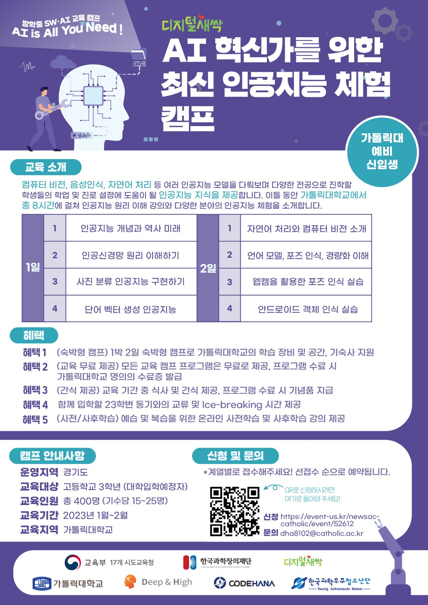

# 2023_SWAIcamp
가톨릭대 방학중 SW/AI 캠프
- 각 교육과정 폴더에 Lecture Instruction이 적혀 있습니다.

## AI 혁신가를 위한 최신 인공지능 체험 캠프 운영 Instruction

** 첫날과 둘째날 실습 하나를 바꿔서 보셔야 합니다. 웹캠을 활용한 포즈 인식 실습을 1일차에, 단어 벡터 생성 인공지능은 2일차에 진행합니다.

* 보조강사는 캠프 시작 전 다음을 체크해 주세요.
  * 보건 : 손소독제, 마스크 학생 수만큼씩, 체온계 (클러스터 사무실에 있습니다)
  * 교재 (제본 형태로 사무실에 있습니다. 학생 부수만큼 챙기기)
  * 교구재 (웹캠, 안드로이드, 폰 충전키트 학생수 만큼) (클러스터 사무실에 있습니다)
  * 교실 난방 체크 (B338호, B346호) - 난방이 잘 되지 않을 경우 02-2164-4138에 연락
  * 오프라인 출석부
  * 숙소 배치 확인 및 카드키 수령 (김도현 연구원에게 확인하면 됩니다)
  * 기념품 수령 (USB와 텀블러, 사무실에서 수령하면 됩니다)
  * 체크카드 수령 (저녁 구매용)
  * B338호에 간식 잘 깔려 있는지 체크
  * B346호 X배너 위치 확인 (출입문 바로 옆)
  
* 주강사는 캠프 시작 전, 학생들에게 작성하게 할 양식을 체크해 주세요.
  * [온라인 출석부](https://forms.gle/CavJWQSqpSp2yGNx6)
  *  [학생용 사전 설문지](https://forms.gle/Tp8yEqfj9xRBbuA86) ★★★★★ 해당 양식 작성 인원으로 실적을 매깁니다. 가장 중요해요
  * [딥앤하이 가입 및 사전/사후학습 안내](https://deepnhigh.com/) - 한 학생들도 있고, 안 한 학생들도 있을 겁니다. 가입 후 홈페이지 밑에 있는 사전/사후학습 들을 수 있다고, 6개월간 열려 있을 거라고 안내해 주세요.

### [1일차]
* 보조강사님은 학생들을 B338호로 오게 안내하고, 들어오면 체온계 재 주시고, 오프라인 출석부를 적게 합니다. 이후 손소독제 안내합니다. 그리고 교재 한 부씩 학생들에게 나눠줍니다.
* 학생들은 B338호에 모여서 30분간 안내를 듣고, 주강사의 안내에 따라 작성해야 되는 서류 (온라인 출석부, 학생용 사전 설문지, 딥앤하이 가입) 를 작성 후 B346호로 이동합니다. 
* 학생들에게 주강사와 보조강사 핸드폰 번호를 알려주세요. 보조강사의 경우 안전관리를 위해 필수적으로 알려주셔야 합니다.
* 이후 주강사는 B346호에서 수업을 진행하고, 보조강사는 저녁 및 저녁후 세션을 준비하고 기숙사 동선을 파악합니다.
* 보조강사는 주강사의 쉬는 시간때 학생들 안내 및 통제를 진행합니다.
* 보조강사는 실습시간 때 뒤쪽에 상주하면서 학생들의 질문을 받거나 어려워하는 학생들을 도와줍니다.
* 보조강사는 실습 시간 때 웹캠을 나눠 주시고, 끝나면 회수하시기 바랍니다.
* 보조강사는 수업 중간중간에 사진을 찍습니다. 교쉴 뒤에서 학생들의 뒷모습과 X배너가 나오도록 사진을 찍어 주시면 됩니다. 캠프 이틀동안 10장 이상 부탁합니다.
* 보조강사는 강의 중간에 나와서 이번 캠프에 배정된 방들에 한번씩 들어가서 침구류를 세팅합니다. 침구류는 남자기숙사의 경우 621호, 여자기숙사의 경우 926호에 있습니다.
* 주강사는 되도록이면 강의시간 50분+쉬는시간 10분을 지켜 주시고, 강의가 늦어도 6시 30분에는 끝날 수 있게 조절해 주세요.
* 주강사는 수업이 끝나면 온라인 출석부를 작성하게 해 주세요.
* 보조강사는 수업이 끝날 때를 미리 맞추어 저녁을 주문합니다. 저녁은 인당 14,000원을 넘지 않게 주문 부탁드려요. (나가서 드시는건 안전문제 때문에 5명 이하일때만 허용하겠습니다)
* 영수증은 항상 품목과 수량이 나온 영수증이 필요합니다. (어느가게에서 얼마 주문했는지만 나오면 안됩니다) 주문시 체크 꼭 부탁합니다.
* 이후 7시반~8시까지 충분히 저녁을 먹게 안내해 주세요.
* 주강사님은 퇴근하셔도 됩니다. (저녁도 드셔도 되고 안드셔도 됩니다)
* 보조강사님들은 저녁시간 이후 학생의 의견을 수렴해서 세션을 진행해 주세요. (Q&A세션, 멘토링 세션, AI영화감상 세션, 또는 학생들의 의견을 반영해서 즉석에서 진행하셔도 됩니다)
* 보조강사는 저녁시간 이후 세션은 9시반~10시 정도까지 진행해 주시고, 이후에는 기숙사로 학생들을 투입해 주세요.
  * 세션을 빨리 끝내고 기숙사와 강의장을 자유롭게 이동하는 형태로 풀어주는 것은 금지합니다. 시간에 맞게 끝내 주세요.
  * 기숙사에 학생들 투입 이후에는 다음날 기상 전까지 건물 밖으로 나올 수 없음을 고지하여 주세요.
  * 추가적으로 더 시켜 먹고 싶은 학생들은 보조강사의 허락을 받고 먹을 수 있게 해주세요. (배달 하더라도 카드가 없으면 문을 열고 받을 수가 없어요)
    * 보조강사님들 전부 퇴근하시면 김도현 연구원에게 연락해 주세요. (010-2864-8956/010-7440-0932)
    * 술은 절대 금지입니다. 미리 갖고온 술 먹다가 걸리거나 할 경우 퇴소 조치한다고 공지해 주세요.

### [2일차]
* 학생들은 오전 8시 45분까지 입실을 시켜 주세요. 
* 김도현 연구원이 8시 45분까지 토스트와 음료수를 세팅해 놓을 겁니다. 9시까지 먹고 수업 진행합시다.
* 이후 주강사는 온라인 출석부로 출석체크 후, 수업을 진행합니다.
* 보조강사는 10시에 기숙사로 가서 학생들이 잤던 방에 들어가 침구류를 가지고 나와서 준비된 차에 실어 놓습니다 (운전기사:김도현/김민지/원현식 연구원)
* 이후 크린토피아까지 함께 이동해 빨래를 맡기고, 전날에 끝냈던 빨래가 있으면 가지고 옵니다.
* 가지고 온 침구류는 621호, 926호에 적절히 나누어 넣어 줍니다.
* 이후 학생들이 쓴 방에 한번씩 들어가서 쓰레기가 있으면 치우고, 깔끔하게 정리합니다.
* 보조강사는 실습시간에 맞추어 안드로이드 폰과 충전키트를 학생들에게 한 대씩 지급합니다. (숫자 잘 세어 주세요)
* 안드로이드 실습이 가장 험난할 것으로 예상됩니다. 주강사와 보조강사 모두 학생들을 잘 도와 주세요.
* 수업이 끝나면 주강사님은 준비하신 멘트 가지고 마무리해 주세요. 수업은 대략 12시 40~45분 정도에 끝내면 적당합니다.
* 이후 주강사님은 학생들에게 온라인 출석부를 적게 해 주시기 바랍니다. [온라인 출석부 링크](https://forms.gle/CavJWQSqpSp2yGNx6)
* 이후 주강사님은 학생들에게 만족도 조사를 실시해 주시기 바랍니다. [만족도조사 링크](https://forms.gle/NB6D31ES645QWZN88)
* 학생들이 실시할 동안 보조강사는 실습 교구재를 회수합니다. 갯수 세어 주세요.
* 보조강사는 수업이 끝나면 사무실에 있는 현수막을 가지고 가서 학생들과 들고 사진을 찍게끔 안내합니다.
* 보조강사는 수업이 끝나면 준비한 기념품들을 학생들에게 나누어 주세요.
* 보조강사는 수업이 끝나면 클러스터에 있는 인원(1층 사무실 또는 2층)에게 영수증을 전달해 주세요.
* 아무쪼록 **안전**에 각별한 주의를 요합니다. 사고가 나면 절대 안됩니다. 

안전하고 재밌는 캠프 부탁드립니다.
